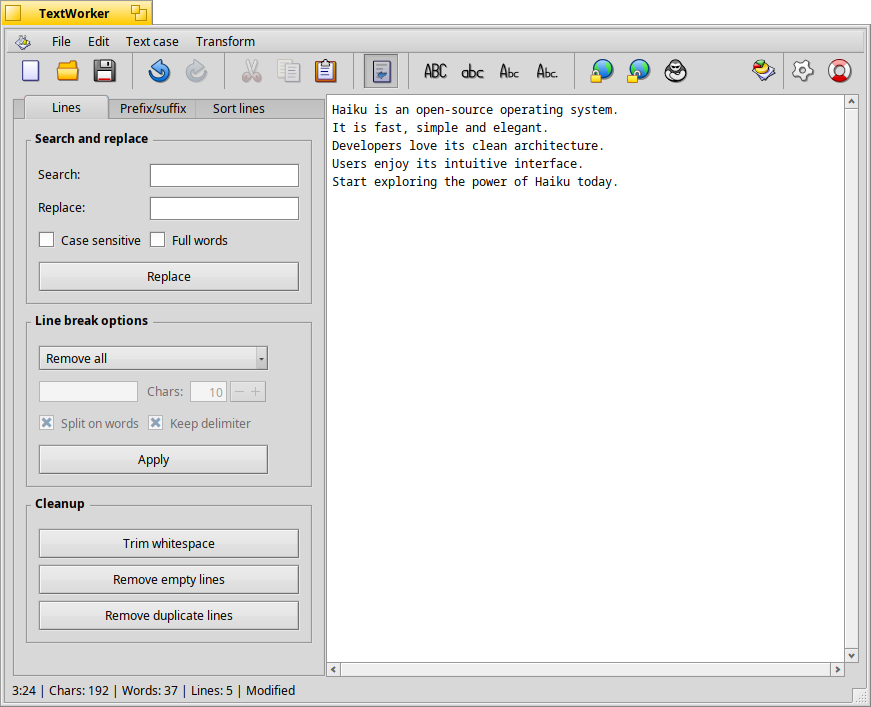

# TextWorker



**TextWorker** is a lightweight, Haiku-native text manipulation tool. It provides useful utilities to transform and clean up plain text, tailored for developers, writers, and anyone who works with text files regularly.

---

## Features

- Convert text to uppercase, lowercase, or titlecase (with full Unicode support)
- Search and replace text
- Break lines using a custom delimiter, with or without keeping the delimiter
- Clean up whitespace and line breaks
- Remove empty or duplicate lines
- Sort lines (ascending/descending, case-sensitive or insensitive, by length)
- Add or remove prefixes/suffixes to/from each line
- Indent or unindent lines using tabs or spaces


---

## Build Instructions

### Dependencies

Make sure the following development package is installed:

```bash
pkgman install icu74_devel
```

### Build

To build the app:

```bash
make
```

---


## License

[MIT License](LICENSE)

---

## Contributions

Pull requests and suggestions are welcome. The app is actively evolving, feel free to add your own text tools!